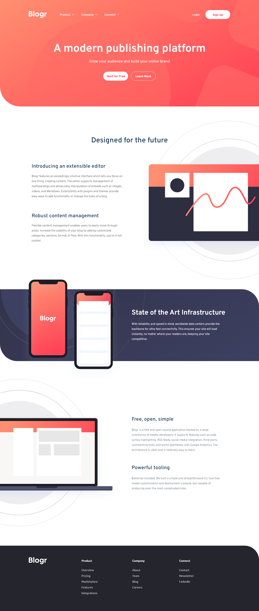

# Frontend Mentor - Blogr landing page solution

This is a solution to the [Blogr landing page challenge on Frontend Mentor](https://www.frontendmentor.io/challenges/blogr-landing-page-EX2RLAApP). Frontend Mentor challenges help you improve your coding skills by building realistic projects. 

## Table of contents

- [Overview](#overview)
  - [The challenge](#the-challenge)
  - [Screenshot](#screenshot)
  - [Links](#links)
- [My process](#my-process)
  - [Built with](#built-with)
  - [What I learned](#what-i-learned)
  - [Continued development](#continued-development)
  - [Useful resources](#useful-resources)
- [Author](#author)
- [Acknowledgments](#acknowledgments)

## Overview

### The challenge

Users should be able to:

- View the optimal layout for the site depending on their device's screen size
- See hover states for all interactive elements on the page

### Screenshot

### Links

- HTML Solution URL: [HTML](https://github.com/JustANipple/blogr-landing-page/blob/master/index.html)
- CSS Solution URL: [CSS](https://github.com/JustANipple/blogr-landing-page/blob/master/styles/css/main.css)
- JavaScript Solution URL: [JS](https://github.com/JustANipple/blogr-landing-page/blob/master/scripts/scripts.js)
- Live Site URL: [LIVE](https://justanipple.github.io/blogr-landing-page/)

## My process

### Built with

- Semantic HTML5 markup
- CSS custom properties
- Flexbox
- CSS Grid
- Mobile-first workflow
- Josh Comeau reset
- SASS preprocessor
- JavaScript

### What I learned

Making an hamburger menu that becomes part of the nav bar when the page is enough large was a challenge. I wrote a lot of lines just to align everything properly.
I think the best solution here would be to stop writing all the code by hand, so i'm thinking of trying to learn a framework to make these long work easier to tweak

### Continued development

I will be working on a framework to make it easier to create complex components that took me a lot of time writing, like a responsive dropdown menu that collapses on mobile view

### Useful resources

- [Pixel perfect](https://chrome.google.com/webstore/detail/perfectpixel-by-welldonec/dkaagdgjmgdmbnecmcefdhjekcoceebi) - I wanted to get as precise as possible with this design, so this extension helped me compare my solution to the design right on the page

## Author

- Frontend Mentor - [@JustANipple](https://www.frontendmentor.io/profile/JustANipple)
